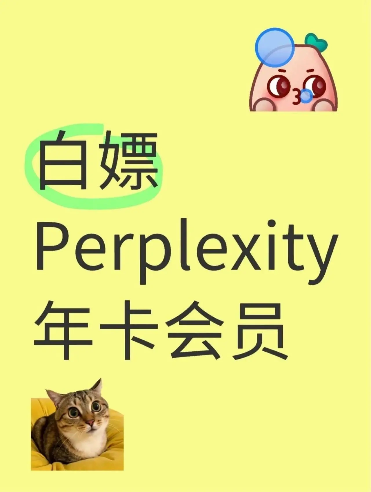

# 免费领取Perplexity年卡会员？先看完这篇再决定

---

最近AI搜索圈又开始热闹了——有人在到处转发Perplexity的免费年卡领取链接。200美元的会员，说免费就免费了？我第一反应是：这玩意儿靠谱吗？

作为一个经常需要深度搜索信息的人，我对Perplexity这类AI搜索工具并不陌生。它确实好用，但免费年卡这种事，听起来就像天上掉馅饼——要么是营销噱头,要么就是数量有限、手慢无的那种。

## 免费年卡是怎么回事

据说操作很简单：打开特定网址，输入验证码，用美国节点访问，年卡到手。听起来像是某种推广活动或者内测福利。

但问题来了——这种免费领取通常有几个特点：

**数量有限**：验证码用完就没了，晚来的人只能干瞪眼。

**使用限制**：可能有地区限制、功能阉割，或者试用期结束后自动扣费。

**稳定性存疑**：今天能用，明天账号会不会突然失效？没人知道。

我见过太多"免费领会员"的套路——领是领到了，但用起来各种不顺心。要么功能受限，要么三天两头掉线，最后还是得掏钱买正式版。

## 如果你真的需要长期稳定使用

说实话，如果只是尝鲜玩玩，这种免费领取倒也无妨。但如果你真的需要把Perplexity用在工作或学习中——比如写论文、做市场调研、技术查询——那稳定性和持续可用才是关键。

免费的验证码随时可能失效,账号说封就封。到时候你辛辛苦苦整理的搜索历史、保存的资料,可能一夜之间就没了。这种风险，值得冒吗?

更实际的选择是什么？👉 [直接入手一个真正稳定的Perplexity Pro年费成品号，24小时自动发货，还有365天质保](https://shaoyumi.com/buy/64)。不用担心验证码失效，不用折腾节点，也不用担心哪天突然用不了。

## 免费的代价往往是时间

我以前也喜欢到处找免费资源——免费VPN、免费会员、免费工具。后来发现，找这些东西花的时间，早就超过了直接购买的成本。

更要命的是，免费资源的不稳定性会打断你的工作节奏。想象一下：你正在赶一份重要报告，突然发现账号登不上去了；或者搜索到一半，提示"免费额度已用完"。这种体验，真的糟心。

对于真正需要深度使用AI搜索工具的人来说，👉 [一个稳定可靠的Perplexity Pro年费成品号](https://shaoyumi.com/buy/64)才是性价比最高的选择——省时间、省心力，关键时刻不掉链子。

---

## 总结

免费领Perplexity年卡这事儿，听起来诱人，但实际体验可能并不如你想象的那么美好。如果只是好奇试试，那倒无妨；但如果你真的需要长期、稳定地使用这类工具，还是建议考虑更靠谱的方案。

毕竟，工具是为了提高效率的，而不是让你花更多时间去折腾它。
